# Abstract
The purpose of this project is to build compressed archive objects (tar.gz) suitable for Amazon S3 Glacier. S3 customers who have not designed for data archiving in their cloud storage architectures and who are looking to reduce operational costs associated with non-archival storage classes may find it costly to archive into Glacier via lifecycle policies or S3 Intelligent Tiering. This is particularly the case if the workloads do not align with cold storage best practices. Best practices include but are not limited to; reducing the number of objects that will ultimately be archived and organizing objects into archives by an indexing scheme or lookup strategy thereby reducing or eliminating the overhead associated with restoring archived objects of interest. 

This project was motivated by a real customer use case that needed to be archived into Amazon S3 Glacier. The objects were logs relatively small in size and produced by a distributed application that was writing them periodically (5 minutes) to S3 Standard. When the customer realized the costs associated with archiving this large number of objects they sought out a solution. The AWS Solutions Architecture Team and the customer did extensive research to come up with this solution and are sharing it freely with others who have a similar use case. 

# Project Description
s3ArchiveBuilder is a Maven Java Project leveraging the AWS Java SDK (2.0+). It is compatible with Java 8+ JRE, Maven version 3.6+ and developed on the open Eclipse IDE. Upon modifying and building the source code into an executable jar file it can be executed on an EC2 instance that satisfies the environment runtime requirements or containerized to run on AWS EKS (Elastic Kubernetes Service) or AWS ECS (Elastic Container Service). This solution is a distributed producer/consumer architecture leveraging AWS SQS (Simple Queue Service) for workload coordination and management.

This sample source code provides customers interested in compressing/archiving objects with a highly performing and cost effective solution that can be modified or evolved to meet business needs. This project should be thought of as a starting point or a framework and should be thoroughly tested in order to ensure that it satisfies specific use cases and requirements set forth by its designers. The source code for this project is a sample and not supported in an official capacity by AWS thus no new features will be added to the project. 

# Error Handling
At present the project makes no assumptions on how users will choose to handle runtime exceptions. Although we do print the exceptions to STD_Out for reference, please make it a point of emphasis if using this project as a starting point to handle all runtime exceptions in accordance with your design methodology. In addition, please review our suggested best practices for required resources (compute, memory, storage) when running this project below in the Architectural Components section. 

# Macro-Architecture Overview
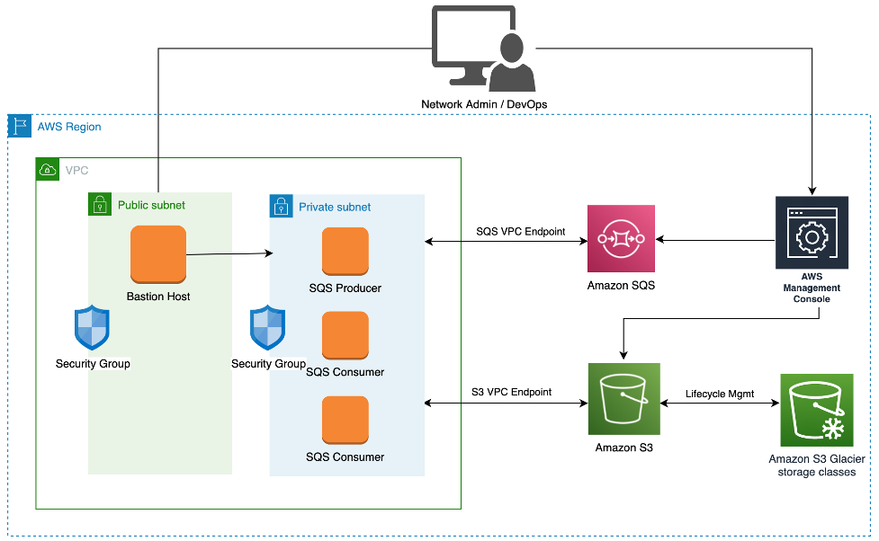

In order to be as cost effective as possible this project should be executed on AWS Compute (EC2/EKS/ECS). However, with the use of AWS IAM Keys it is possible to run this solution on-premises compute as well. If running on-premises be aware of the bandwidth costs associated with reading objects out of Amazon S3. Consider the tradeoffs associated between bandwidth cost and running the solution directly on the AWS Cloud. In addition, in the interest of security and cloud security best practices it is recommended that the solution be executed in a private subnet. This private subnet should only be accessed by a secure bastion host as shown in the macro-architecture diagram. Of particular interest are the service endpoints used to communicate with the AWS resources such as Amazon S3 and Amazon SQS directly via AWS PrivateLink. This is achieved by utilizing Interface/Gateway Endpoints that can be configured directly from the VPC panel on the AWS Console. See the procedures below for more information on how to do this.

[Procedure to configure S3 Gateway Endpoint](https://aws.amazon.com/blogs/aws/new-vpc-endpoint-for-amazon-s3/)

[Procedure to configure SQS Interface Endpoint](https://aws.amazon.com/about-aws/whats-new/2018/12/amazon-sqs-vpc-endpoints-aws-privatelink/)

Upon configuring the Interface/Gateway Endpoints from your VPC, use the AWS CLI from an EC2 instance in your private subnet to ensure that the services can be reached via AWS Private Link:

```
#aws s3 ls
#aws sqs list-queues
```

## Architectural Components
This project has three major architectural components: controller, producer and consumer. The controller always runs and is responsible for reading the configuration and initializing/starting the right processing component (producer or consumer). The SQS Producer lists objects from a source S3 bucket and constructs archive work contexts (work items). An archive work context contains information about all the keys that should be included into an archive file such as tar. Archive work contexts produced by SQS Producer are uploaded to an Amazon SQS Standard Queue where they could be processed by consumers (workers). SQS Consumers are threads that retrieve and process archive work contexts from the Amazon SQS standard queue. Upon retrieving an archive work context the SQS Consumers will read all the objects listed in the context from Amazon S3 (asynchronously) and write/stream these objects (InputStreams) into a compressed archived file (tar.gz). Once the compressed archive file is created, uploaded to the target bucket with the Amazon S3 Glacier Flexible Retrieval storage class (formerly Amazon S3 Glacier). Upon successful archival, the SQS Consumer thread will not delete the source objects included in the archive! If your use case calls for deleting the source objects from Amazon S3 Standard once archives are created and committed to Amazon S3 Glacier Flexible Retrieval, modify the source code to delete these objects after they are successfully uploaded. SQS Consumer threads will exit as soon as they detect an Amazon SQS Queue size of 0.     

The SQS Producer is intended to be single threaded and requires minimal resources to run. It can be effectively executed on free tier compute (e.g. t2.micro) as it is not the performance bottleneck of the system. Archive work contexts will be generated a lot faster than they can be consumed/processed unless the SQS Consumer fleet consists of many EC2 instances each running multiple SQS Consumer threads. It is highly recommended that the bulk of intelligence around generating the archive work contexts be programmed into the SQS Producer. That is, in order to optimize the efficiency of the architecture, the SQS Consumers shouldn't do any special processing that can lead to unpredictability of the performance model other than the basic work flow defined; read objects, add objects to archive, upload archives to Amazon S3 Glacier, optimally delete source objects.

The SQS Consumers are intended to be run as a multi-threaded, distributed application or cluster that can digest work items from the SQS Queue. At present, the SQS Consumers will only run one Consumer thread per vCPU in order to optimize performance and reduce cpu context switching. However, this can easily be modified in the SQS Consumer source code. Each SQS Consumer thread carries out the same function within the s3ArchiveBuilder distributed application and the workload is fully idempotent, assuming the source is not modified to delete source objects after archives have been successfully uploaded. 

# Maven Project Import Instructions
Use git to clone the project locally and then import it as a Maven Project into your Java IDE. (Eclipse or the IntelliJ). The following instructions show how to do this in Eclipse but there are tutorials available  that show how to do this on IntelliJ. [Import Maven Project into IntelliJ](https://www.lagomframework.com/documentation/1.6.x/java/IntellijMaven.html)

  1. Open Eclipse and create a new workspace (e.g. s3ArchiveBuilder)
  
  2. File -> Import -> Maven -> Existing Maven Project -> Next
  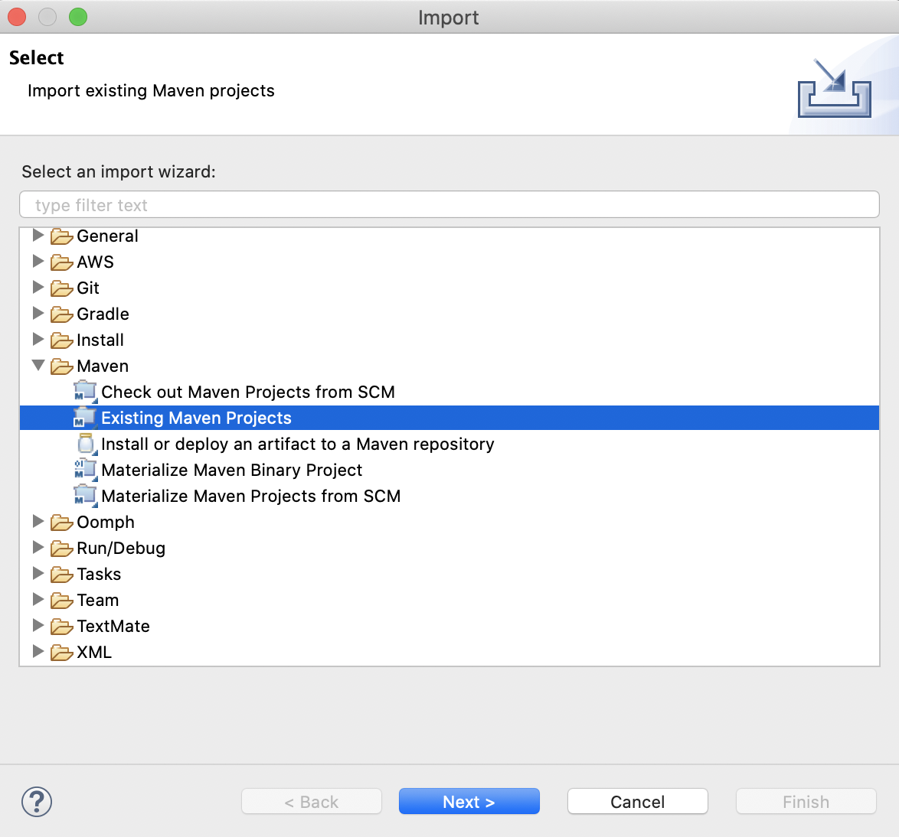
  
  3. Select the root directory containing pom.xml -> Next
  
  4. Project appears in Project Explorer
  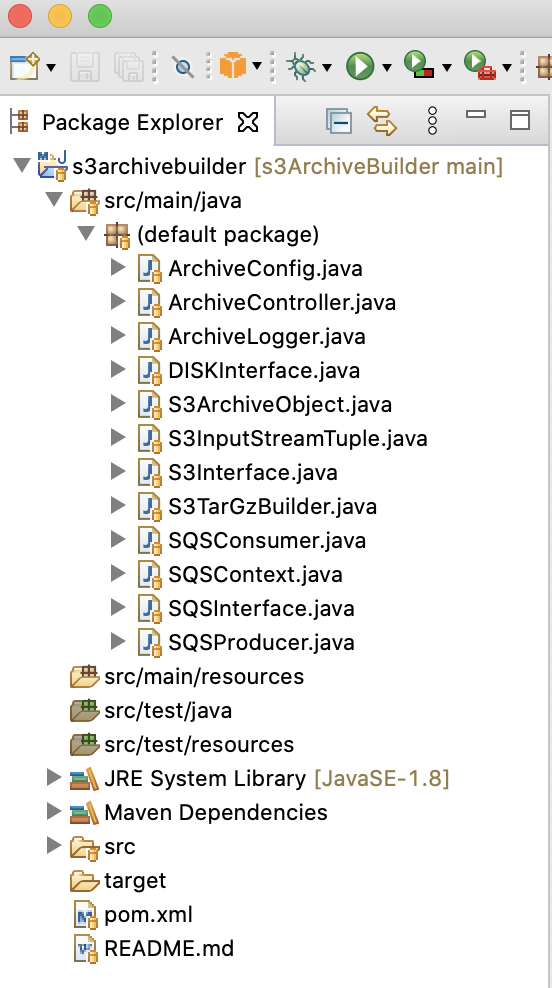
  
  5. Modify source code as necessary
  
  
# Building Instructions  
To build the project directly on Eclipse you may configure a Maven Run Configuration. Equivalently the project may also be built on a terminal window (shell).

  1. Right Click on Project (Project Explorer) -> Run As -> Run Configurations -> Maven Build
  
  2. Create a New Maven Build Configuration (Substitute path to your own BaseDirectory, Ensure you have selected the right JRE 1.8+)
  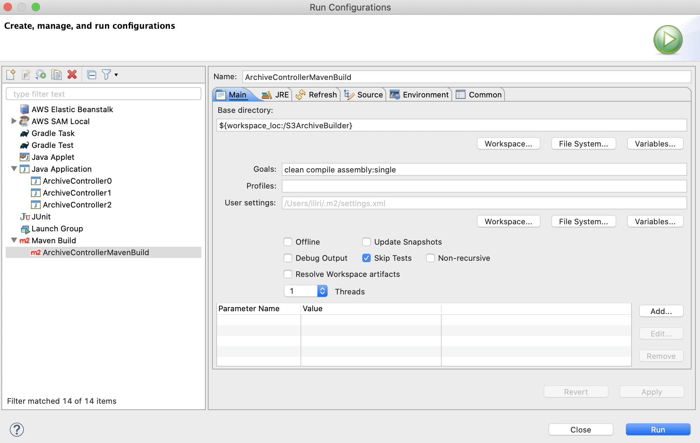
  
  3. Alternatively Build the Project on Terminal Shell
  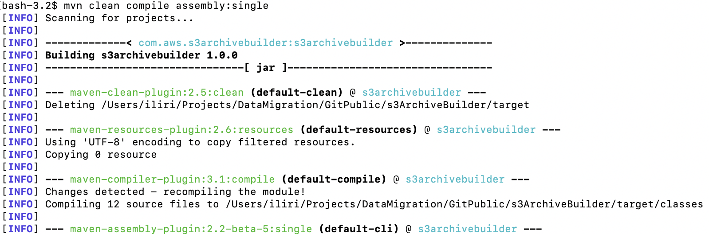
  ...
  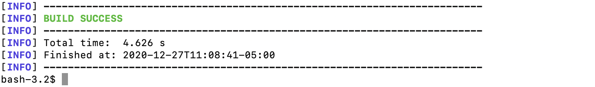
  
  4. In both cases the resulting executable can be found in the target folder
  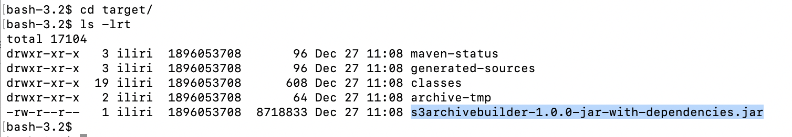

# Platform Requirements 
Before running this application it is important to ensure that the compute runtime environment supports it. Since the application is written in Java it can run on any Platform so long as the Java JRE is installed. As previously noted this project is compatible with Java 8 but should compile and work on higher java versions (8+). With that said, it is recommended that some testing is done to ensure that everything will work as expected. To install Java 8 openjdk on Amazon Linux 2 issue the following command:

```
# sudo yum install java-1.8.0-openjdk
```

Take note that this command will require access to the internet to work as it has to pull from yum repositories. Issuing this command from an EC2 instance in a private subnet will not work as there will be no route to the public internet. This will require a NAT Gateway to get out to an internet gateway that can route requests to the public internet. Thus, if this solution is to be executed in a private subnet it is recommended that a NAT Gateway is temporarily set up to ensure that the java jdk can be installed.  

## Project Configuration File
The application takes a json configuration file as input at runtime via a Java System Property. The following configuration options are currently supported. 

```
Key: type 
Description: The "type" configuration parameter is set to specify whether the application will run the producer or the consumer 
Examples: "type":"producer", "type":"consumer"

Key: authType 
Description: The "authType" configuration parameter is set to specify whether the application will use AWS IAM Keys based access (~/.aws/credentials) or AWS IAM Role based access. For running the project on EC2 or EKS it is recommended that IAM Role Based access be used for increased security.
Examples: "authType":"iam-keys", "authType":"iam-role"

Key: baseDirectory 
Description: The "baseDirectory" configuration parameter is the Linux or Windows Directory Path where the application will write logs and use as disk space to generate archives. Sufficient disk space should be allocated to this application in order to support logs as well as NumThreads * Expected Archive Size in bytes
Examples: "baseDirectory":"/home/ec2-user/BaseDir0/", "baseDirectory":"C:\home\ec2-user\BaseDir0\"

Key: sourceBucket 
Description: The "sourceBucket" configuration parameter is the s3 bucket name that will be listed by the SQSProducer in order to generate SQS Work Contexts for SQSConsumer to process. The "sourceBucket" will also be used by SQSConsumer to read objects that will be included in the generated archives. 
Example: "sourceBucket":"migration-archive-objects"

Key: targetBucket 
Description: The "targetBucket" configuration parameter is the s3 bucket name that SQSConsumer will use to upload generated archives. This value may be equal to sourceBucket if generated archives are to be written to the same s3 bucket. 
Example: "targetBucket":"migration-archive-objects-2"

Key: archiveFilePrefix 
Description: The archiveFilePrefix configuration parameter is prepended to the generated archive file name.
Example: "archiveFilePrefix":"Archive" 
ArchiveFileName: <archiveFilePrefix>_<device_id>.tar.gz 
i.e: Archive_device-025dd26c-c7ce-44c3-839d-707ff05c1edf_2018.tar.gz 

Key: archiveFileFolder
Description: The "archiveFileFolder" configuration parameter is used to specify the folder within the s3 targetBucket where generated archives are to be uploaded by SQSConsumer. If this value is left empty the archive files shall be written at the root location of the targetBucket. It is advisable to set this value to something like Archives/
Example: "archiveFileFolder":"Archives/",
ArchiveFolderName: s3://targetBucket/<archiveFileFolder>/<ArchiveFileNames> 
i.e: s3://uploadArchivesBucket/Archives/Archive_device-025dd26c-c7ce-44c3-839d-707ff05c1edf_2018.tar.gz

Key: region 
Description: The "region" configuration parameter specifies the AWS region where this application will run. Currently we assume that the S3 buckets and the SQS Queue are in the same region. Additional design considerations and modifications are required to support cross-regional resources. 
Example: "region":"us-east-2"

Key: queue 
Description: The "queue" configuration parameter specifies the URL to the Standard SQS Queue that will store the SQS Contexts to be processed by SQSConsumer.
Example: "queue":"https://sqs.us-east-2.amazonaws.com/12345678912345/S3ArchiveBuilder"

Key: s3ListingPrefix
Description: The "s3ListingPrefix" configuration parameter is used by SQSProducer during s3 listing as it works to build SQS Contexts. The prefix value is used to instruct s3 to only return keys containing the specified prefix. This is a useful parameter if you do not want to list all the objects in a bucket just to obtain a specific subset that you are interested in. 
Example: "s3ListingPrefix":"Archives/"

Key: s3ListingMarker 
Description: The "s3ListingMarker" configuration parameter is the starting key specified in the listing request. The listing marker will tell S3 to return only keys following/after the specified marker. This parameter is useful for cases where the SQSProducer needs to be restarted where it left off. This can happen in the event of an abnormal application exit an application crash or a platform crash. 
Example: "s3ListingMarker":"/devices/device-id-0000000123/objectFile.txt"

Key: s3ListingFilter 
Description: Used by SQS Producer to further filter out keys to be used in archives. By including a filter all keys containing the filter will be included while all keys that don’t contain the filter will be discarded. Could be beneficial for s3 buckets are aren’t optimally partitioned such that a prefix may be used
Example: "s3ListingFilter":"5m-device-metrics"

Key: sqsProducerMode 
Options: [run, dry-run]
Description: When this value is set to “run” the SQS Producer will generate SQS Work Contexts and start uploading them to the SQS Queue specified. If the value is set to “dry-run” the SQS Producer will run in test mode. That is it will list and generate contexts but rather than uploading to the SQS Queue it will just log them locally. Useful in customer testing to ensure that the SQS Producer is listing correctly and building work contexts to specification. 
Example: "sqsProducerMode":"run" or "sqsProducerMode":"dry-run"

Name: s3MaxConCount 
Description: The "s3MaxConCount" represents the maximum number of HTTP S3 Connections to open. No more than this value in parallel of s3 operations will be executed. Requests will be queued on the SQSConsumer until connections become availalbe. This value should be set high if failing to saturate your network interface, particularly if the number of objects read from S3 is small in size. 
Example: "s3MaxConCount":"200"
```
## Example Configuration Files

Example Producer Configuration File:
```
{
    "type":"producer",
    "authType":"iam-keys",
    "baseDirectory":"/home/ec2-user/BaseDir0/",
    "sourceBucket":"migration-archive-objects",
    "targetBucket":"migration-archive-objects-2",
    "archiveFilePrefix":"Archive",
    "archiveFileFolder":"Archive/",
    "region":"us-east-2",
    "queue":"https://sqs.us-east-2.amazonaws.com/99999999999999/S3ArchiveBuilder",
    "s3ListingPrefix":"",
    "s3ListingMarker":"",
    "s3ListingFilter":"5m-device-metrics",
    "sqsProducerMode":"run",
    "s3MaxConCount":"1"
}
```

Example Consumer Configuration File:
```
{
    "type":"consumer",
    "authType":"iam-keys",
    "baseDirectory":"/home/ec2-user/BaseDir1/",
    "sourceBucket":"migration-archive-objects",
    "targetBucket":"migration-archive-objects-2",
    "archiveFilePrefix":"Archive",
    "archiveFileFolder":"Archive/",
    "region":"us-east-2",
    "queue":"https://sqs.us-east-2.amazonaws.com/99999999999999/S3ArchiveBuilder",
    "s3ListingPrefix":"",
    "s3ListingMarker":"",
    "s3ListingFilter":"5m-device-metrics",
    "sqsProducerMode":"run",
    "s3MaxConCount":"200"
}
```

## Testing Procedure: Pre-Work
To help customers get started with this project we have included some test data along with a testing procedure. Before uploading this data to an Amazon S3 bucket, the test data archive must first be extracted. This will create a test_data directory in the root folder of the cloned repository. 

```
tar xvfz test_data.tar.gz
```

Next, upload the test_data folder recursively to your test Amazon S3 bucket. The test_data is approximately 340 MB after extraction. Replace <DEST_BUCKET> in the command below with the actual name of your Amazon S3 bucket. The test_data will start to upload and it will take some time to upload fully.

```
 aws s3 cp test_data s3://<DEST_BUCKET>/ --recursive
```

Once uploaded to your Amazon S3 bucket the contents of the test_data should be as follows:

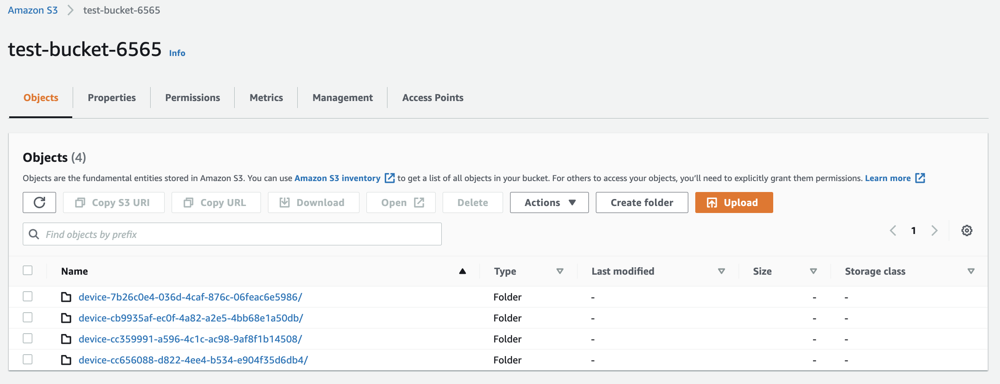

Note: There are no operational costs or bandwidth costs associated with object uploads into Amazon S3 Standard. However, standard storage costs will apply for this test data. For the test data we have included ~ 340 MB you can expect to pay ~ $0.006 per month (as of: 3/1/2022). Once the data is fully uploaded you can execute the application as shown below. If you have not yet built the project, see the Build Instructions section of this document to generate the executable (jar). 

## Testing Procedure: Running Producer
Prior to running the SQS Producer make sure you have created an Amazon SQS Standard Queue and have the URL for the queue handy as it will be required for the the producer/consumer configuration files. In order to align with the rest of the procedure as written, name the producer configuration file as: /home/ec2-user/BaseDir_Producer/Configuration/ControllerConfiguration.json. Make sure you include the name of your Amazon S3 bucket and the URL to your own SQS Standard Queue instead of what the test configuration below shows. 

Test Producer Configuration File:
```
{
    "type":"producer",
    "authType":"iam-role",
    "baseDirectory":"/home/ec2-user/BaseDir_Producer/",
    "sourceBucket":"test-bucket-6565",
    "targetBucket":"test-bucket-6565",
    "archiveFilePrefix":"Archive",
    "archiveFileFolder":"Archive/",
    "region":"us-east-2",
    "queue":"https://sqs.us-east-2.amazonaws.com/815930979491/S3ArchiveBuilder",
    "s3ListingPrefix":"",
    "s3ListingMarker":"",
    "s3ListingFilter":"5m-device-metrics",
    "sqsProducerMode":"run",
    "s3MaxConCount":"1"
}
```

To run the executable on an AWS Linux 2 instance issue the following command in a screen session. The screen session ensures that the job keeps running in the background even if you disconnect from your EC2 instance. 

```
#screen -S producer
#java -DconfigurationFile='/home/ec2-user/BaseDir_Producer/Configuration/ControllerConfiguration.json' -jar s3archivebuilder-1.0.0-jar-with-dependencies.jar
#

CTRL+A+D (detach from screen session)
screen -r producer (attach to existing screen session)
```

Upon completion, the producer application will have created 6 messages in the SQS Standard Queue. You can navigate to the SQS Service on the AWS Console and inspect your standard queue which should now be holding 6 messages corresponding to 6 work archive contexts that need to be processed by SQS Consumers. 

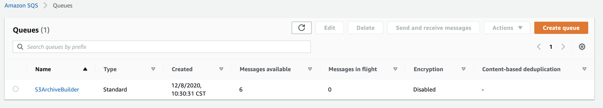

In addition, the controller application will have created two sub-folders in the base directory specified which will store the application logs. These folders are named as: /home/ec2-user/BaseDir_Producer/Controller and /home/ec2-user/BaseDir_Producer/Producer accordingly. Inspect these directories and the corresponding logs generated to get an idea of what the producer application did during the last execution.  

## Testing Procedure: Running Consumers
Prior to running the SQS Consumers make sure the Amazon SQS Standard Queue exists and is populated by 6 messages corresponding to the 6 test archive work contexts. The consumers will process these archive work contexts to generate and upload archives to Amazon S3 Glacier. In order to align with the rest of the procedure as written, name the consumer configuration file as: /home/ec2-user/BaseDir_Consumer/Configuration/ControllerConfiguration.json Make sure you include the name of your Amazon S3 bucket and the URL to your own SQS Standard Queue instead of what the test configuration below shows. 

Test Consumer Configuration File:
```
{
    "type":"consumer",
    "authType":"iam-role",
    "baseDirectory":"/home/ec2-user/BaseDir_Consumer/",
    "sourceBucket":"test-bucket-6565",
    "targetBucket":"test-bucket-6565",
    "archiveFilePrefix":"Archive",
    "archiveFileFolder":"Archive/",
    "region":"us-east-2",
    "queue":"https://sqs.us-east-2.amazonaws.com/815930979491/S3ArchiveBuilder",
    "s3ListingPrefix":"",
    "s3ListingMarker":"",
    "s3ListingFilter":"5m-device-metrics",
    "sqsProducerMode":"run",
    "s3MaxConCount":"200"
}
```

To run the executable on an AWS Linux 2 instance issue the following command in a screen session. The screen session ensures that the job keeps running in the background even if you disconnect from your EC2 instance. 

```
#screen -S consumer
#java -DconfigurationFile='/home/ec2-user/BaseDir_Consumer/Configuration/ControllerConfiguration.json' -jar s3archivebuilder-1.0.0-jar-with-dependencies.jar
#

CTRL+A+D (detach from screen session)
screen -r consumer (attach to existing screen session)
```

Note: The application will run N consumer threads in parallel (where N = number_vCPU Cores of the underlying compute instance). Upon completion the consumer application will have consumed 6 entries from the SQS Standard Queue. You can navigate to the SQS Service on the AWS Console and inspect your standard queue which should now be holding 0 unprocessed messages.

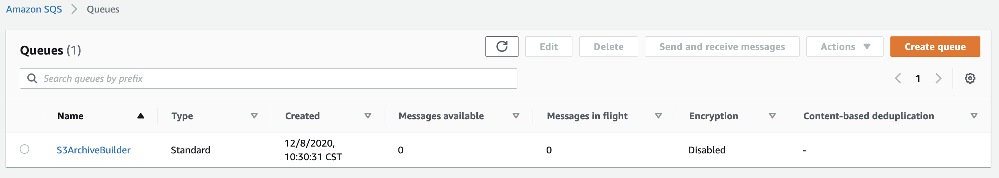

In addition, the controller application will have created two sub-folders in the base directory specified which will store the application logs. These folders are named as: /home/ec2-user/BaseDir_Consumer/Controller and /home/ec2-user/BaseDir_Consumer/Consumer accordingly. Inspect these directories and the corresponding logs within to get an idea of what the application did during the last execution. 

Finally, navigate to your bucket on the Amazon S3 Console to confirm that the archives have been generated and uploaded according per the configuration. All archival objects should reflect the Amazon S3 Glacier Flexible Retrieval storage class (previously Amazon S3 Glacier). 

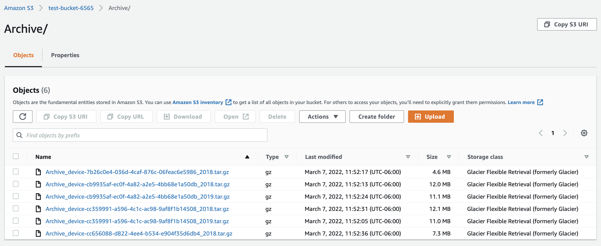

Note: If you want the consumers to upload archive objects to an Amazon S3 Storage Class other than Amazon S3 Glacier, please make the change in S3Interface.java line 136. Comparably you may consider making the storage class a configuration option and including it in your project for simplicity. 

## Testing Procedure: Clean-Up
Be sure to clean-up any AWS resources created as part of this procedure that may continue to incur AWS Costs such as emptying the test data as well and generated archival data from the Amazon S3 bucket. In addition, be sure to empty out the SQS Standard Queue and delete it if you are no longer using it or testing with it. 

